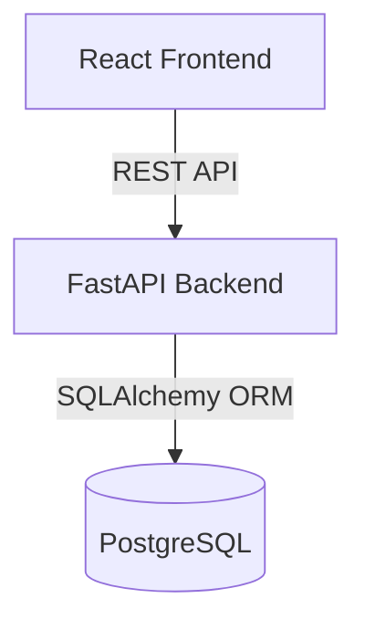

# Full-Stack Inventory & Order Management System

A production-ready full-stack Inventory & Order Management System built with React, FastAPI, and PostgreSQL, fully containerized using Docker and Docker Compose.

## Features
- **Dashboard**: Real-time summary and statistics, inventory charts, and low-stock alerts.
- **Product Management**: Complete CRUD with stock tracking and SKU constraints.
- **Customer Management**: Register and manage customer profiles.
- **Order Processing**: Place orders with real-time stock availability checks. Orders automatically reduce stock and calculate total prices.
- **Modern UI**: Built with React, Tailwind CSS, Lucide icons, and Recharts, utilizing modern glassmorphism design.

## Architecture



## Setup Instructions
1. Clone this repository.
2. Ensure you have Docker and Docker Compose installed.
3. Start the application:
```bash
docker-compose up --build
```
4. Access the frontend at `http://localhost:3000`.
5. Access the backend Swagger API Docs at `http://localhost:8000/docs`.

## Deployment Steps
### Backend
1. **Render / Railway**: 
   - Connect your GitHub repository.
   - Choose Docker deployment for the backend.
   - Set the `DATABASE_URL` environment variable to your managed PostgreSQL instance.

### Frontend
1. **Vercel / Netlify**:
   - Connect your GitHub repository.
   - Root directory: `frontend`
   - Build command: `npm run build`
   - Output directory: `dist`
   - Set the `VITE_API_URL` environment variable to your deployed backend URL.

## Environment Variables
Create a `.env` file based on `.env.example` to test locally or modify configuration.
